# Retail Orders SQL Analysis

Portfolio Project | MySQL | Dimensional Modeling | SQL Analytics | Python | Pandas | Seaborn | Business Intelligence

## Overview

This project analyzes retail order performance using a dimensional data warehouse built in MySQL and a Python visualization workflow.

The analysis transforms raw transactional order data and product-supplier reference data into a structured star schema for business reporting. SQL is used for schema design, data cleaning, dimensional modeling, validation, analytical queries, and export generation. Python is used to load the validated SQL outputs, create polished visualizations, and present business recommendations.

The project evaluates revenue, estimated profit, customer segment performance, product category performance, supplier contribution, profitability efficiency, and delivery performance. The goal is to identify the strongest business drivers, surface concentration risks, and provide practical recommendations for retail operations, merchandising, supplier management, and leadership review.

## Project Preview

### Revenue Trend

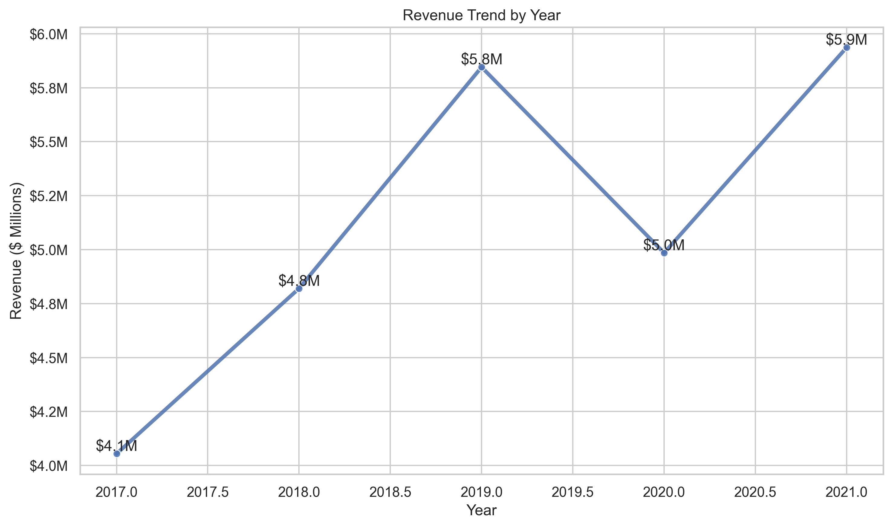

### Revenue vs Profit by Product Category

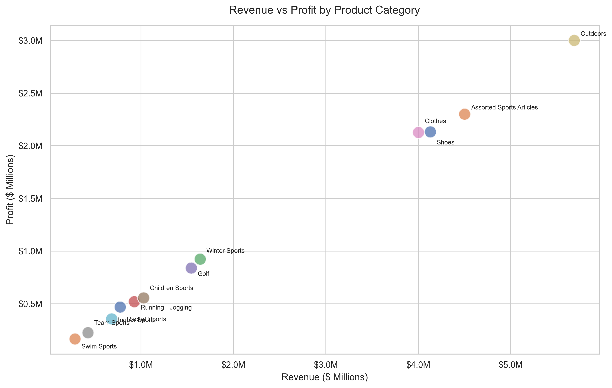

## Dataset

The project uses a retail orders dataset made up of two source files:

- `orders.csv`
- `product-supplier.csv`

The raw orders file contains transactional sales records, including customer status, order dates, delivery dates, product IDs, quantities, revenue, and cost price per unit.

The product-supplier file contains product catalog and supplier metadata, including product line, product category, product group, product name, supplier country, supplier name, and supplier ID.

Reconnaissance confirmed:

- `orders.csv` contains 185,013 rows and 9 columns.
- `product-supplier.csv` contains 5,504 rows and 8 columns.
- No missing values were identified during reconnaissance.
- `Product ID` successfully links orders to product and supplier metadata.
- Customer status values required standardization because of capitalization inconsistencies.

## Data Warehouse Design

The project uses a dimensional warehouse design built in MySQL.

The warehouse includes raw staging tables, dimension tables, and a central fact table. Raw staging tables preserve the original imported data, while cleaned analytical tables support reproducible SQL analysis.

### Staging Tables

- `orders_raw`
- `product_supplier_raw`

### Dimension Tables

- `dim_customer_status`
- `dim_product`
- `dim_supplier`

### Fact Table

- `fact_orders`

### Derived Metrics

The warehouse adds business-ready metrics during SQL transformation:

- `delivery_days`
- `estimated_cost`
- `estimated_profit`
- `gross_margin_pct`

The final dimensional model supports analysis across customers, products, suppliers, revenue, profitability, and delivery performance.

## Methods / Workflow

The project followed a structured analytics workflow.

1. Dataset reconnaissance

   The raw files were profiled to validate row counts, column structure, missing values, date fields, product relationships, customer status quality, product hierarchy, and supplier hierarchy.

2. Schema design

   A star schema was designed around `fact_orders`, supported by customer status, product, and supplier dimensions.

3. Data import

   Source CSV files were imported into MySQL staging tables while preserving the raw source values.

4. Data cleaning and dimensional modeling

   SQL was used to standardize customer status values, convert date fields, populate dimensions, populate the fact table, calculate derived metrics, and validate referential integrity.

5. SQL analysis

   Analytical SQL queries were developed to answer business questions about revenue, profit, customer segments, product categories, suppliers, concentration risk, and delivery performance.

6. Export generation

   Aggregated SQL outputs were exported as CSV files for Python-based visualization.

7. Python visualization

   The final notebook loads the exported datasets with Pandas and creates visualizations using Matplotlib and Seaborn.

8. Business interpretation

   Findings were translated into portfolio-ready insights and strategic recommendations.

## Tools Used

- MySQL
- MySQL Workbench
- SQL
- Python
- Pandas
- NumPy
- Matplotlib
- Seaborn
- Jupyter Notebook
- Git
- GitHub

## Project Structure

```text
retail_orders_sql_analysis/
├── datasets/
│   ├── processed/
│   └── raw/
│       ├── orders.csv
│       └── product-supplier.csv
├── exports/
│   ├── charts/
│   │   ├── average_order_value_trend.png
│   │   ├── delivery_performance_by_category.png
│   │   ├── order_volume_by_status.png
│   │   ├── profit_by_category.png
│   │   ├── profit_by_supplier.png
│   │   ├── profit_trend.png
│   │   ├── revenue_by_category.png
│   │   ├── revenue_by_status.png
│   │   ├── revenue_by_supplier.png
│   │   ├── revenue_trend.png
│   │   └── revenue_vs_profit_by_category.png
│   ├── datasets/
│   │   ├── 01_yearly_kpis.csv
│   │   ├── 02_customer_segment_summary.csv
│   │   ├── 03_product_category_summary.csv
│   │   ├── 04_supplier_revenue_summary.csv
│   │   ├── 05_supplier_profit_summary.csv
│   │   ├── 06_product_profitability_summary.csv
│   │   └── 07_delivery_performance_summary.csv
│   └── reports/
│       ├── analysis_notes.md
│       ├── analysis_plan.md
│       ├── cleaning_decisions.md
│       ├── data_dictionary.md
│       ├── findings_log.md
│       ├── phase4_export_plan.md
│       ├── phase4_notebook_plan.md
│       ├── reconnaissance_summary.md
│       ├── retail_orders_analysis.html
│       ├── retail_orders_analysis.pdf
│       └── schema_design_notes.md
├── notebooks/
│   └── retail_orders_analysis.ipynb
├── sql/
│   ├── 01_schema.sql
│   ├── 02_import_notes.md
│   ├── 03_data_cleaning.sql
│   ├── 04_analysis_queries.sql
│   ├── 05_views.sql
│   └── 06_phase4_exports.sql
├── .gitignore
├── project_plan.md
├── requirements.txt
└── README.md
```

Note: `datasets/raw/` reflects the local reproducibility layout and is ignored by Git. `sql/test_import.sql` and `notebooks/exploratory/` are local-only development files and are also ignored by Git.

Documentation status:

- `exports/reports/data_dictionary.md` documents source fields, warehouse tables, derived metrics, analytical views, and exported reporting datasets.
- `sql/05_views.sql` contains reusable analytical views that summarize customer, product, supplier, and delivery performance.

## Visualizations

### Revenue Trend


### Profit Trend

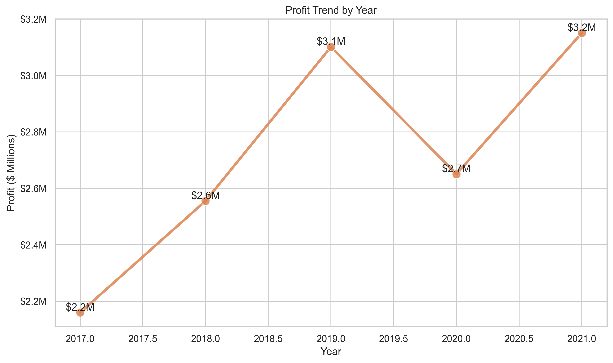

### Average Order Value Trend

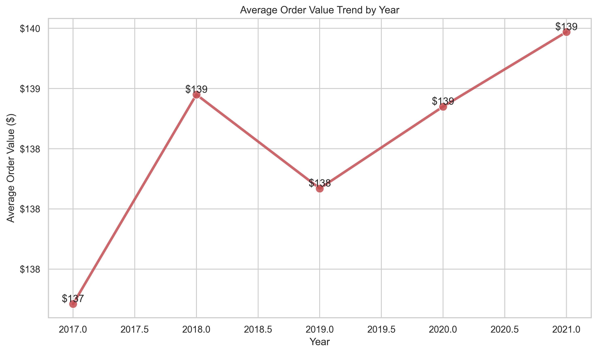

### Revenue by Customer Status

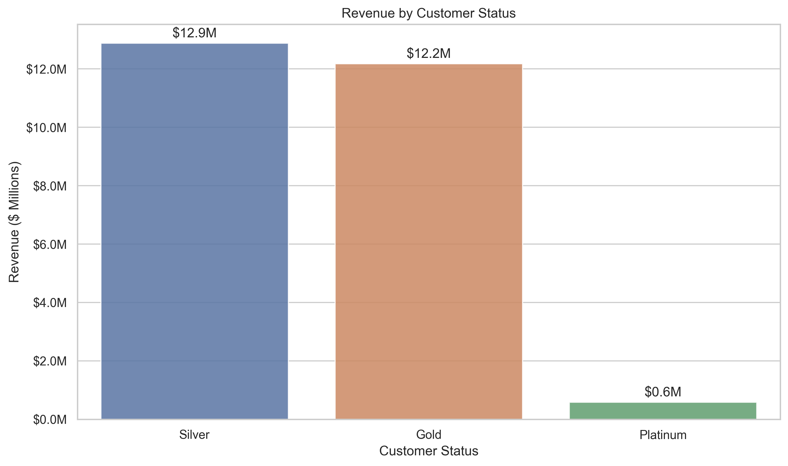

### Order Volume by Customer Status

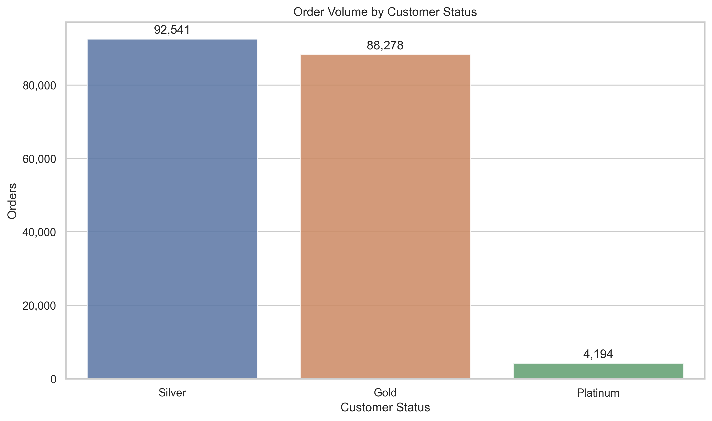

### Revenue by Product Category

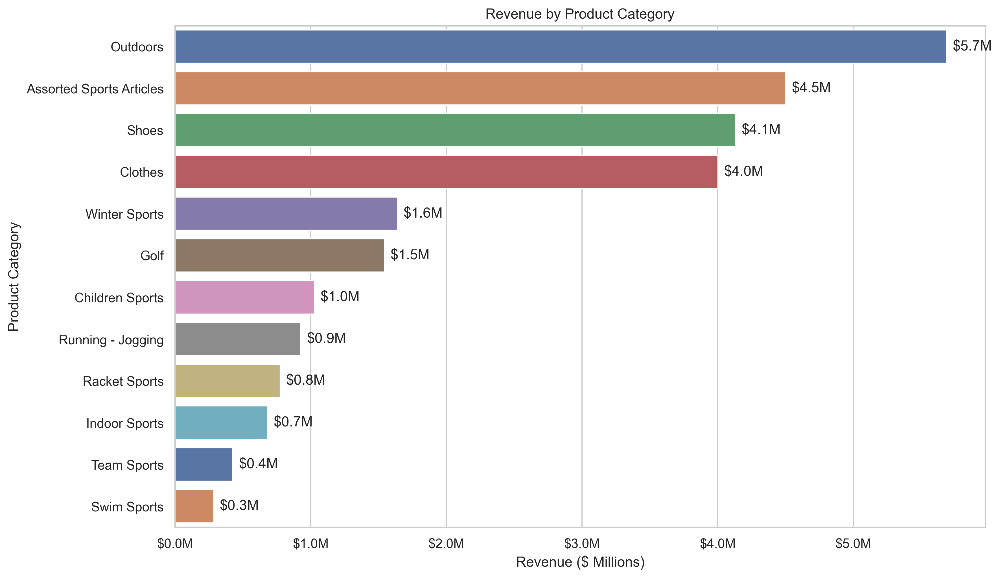

### Profit by Product Category

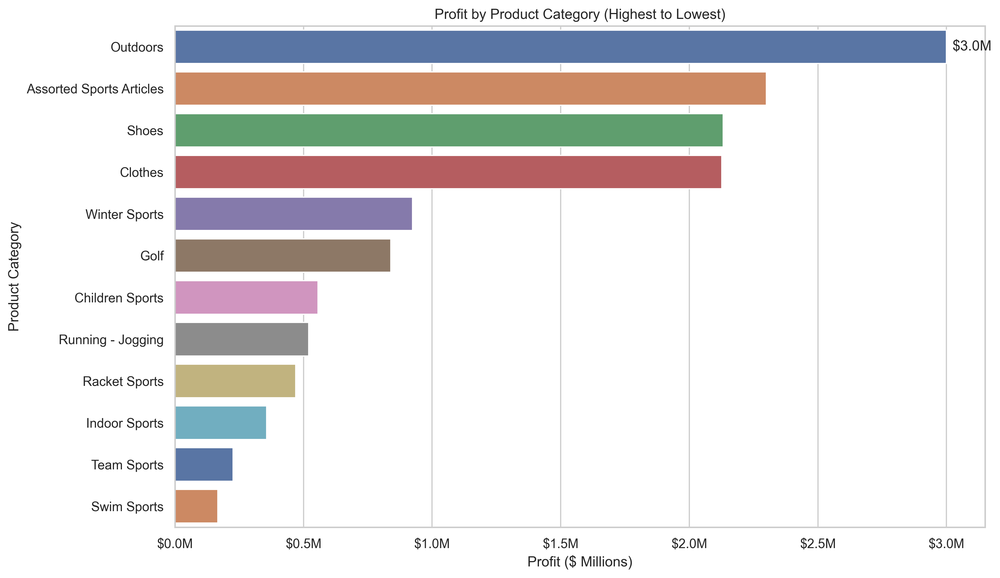

### Revenue by Supplier

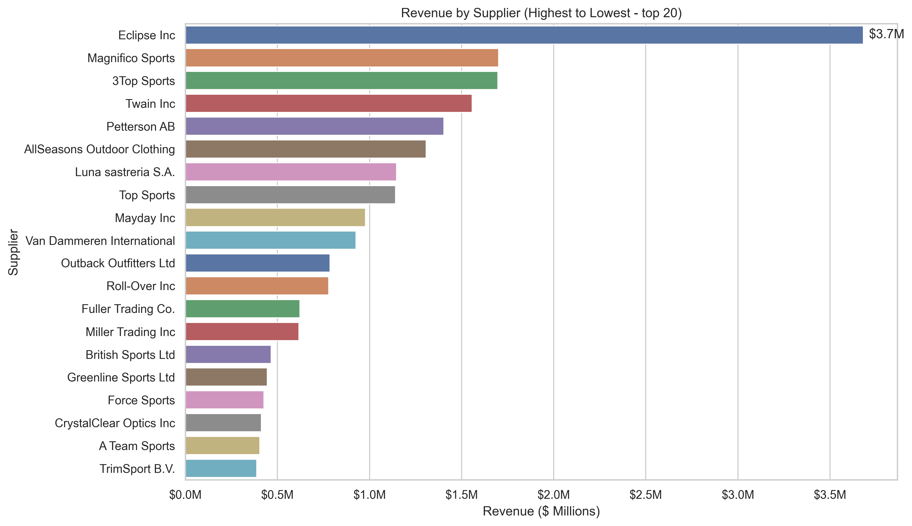

### Profit by Supplier

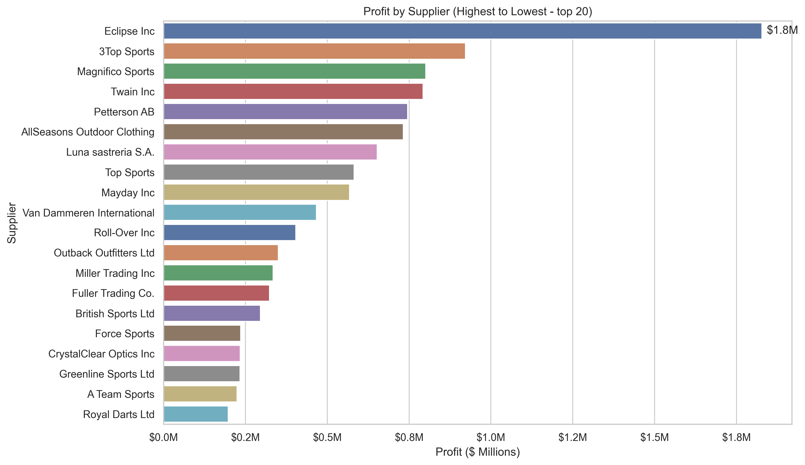

### Revenue vs Profit by Product Category


### Delivery Performance by Product Category

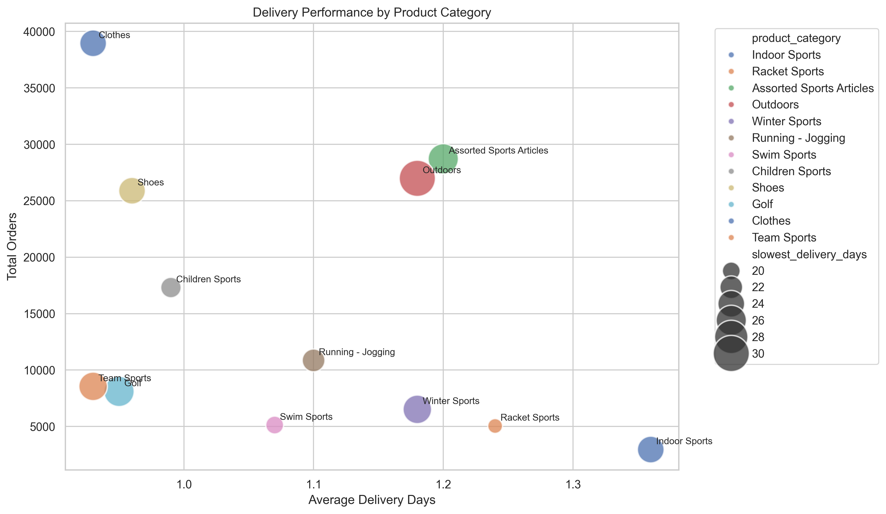

## Key Findings

- The business generated more than $25.6 million in revenue and approximately $13.6 million in estimated profit across 185,013 order records.
- Revenue and profit declined in 2020 before recovering strongly in 2021.
- Silver and Gold customers generated nearly all revenue and profit, while Platinum customers contributed a relatively small share of business activity.
- Outdoors was the strongest product category by both revenue and estimated profit.
- Assorted Sports Articles, Shoes, and Clothes also performed consistently as major revenue and profit contributors.
- Racket Sports and Swim Sports had the strongest profit margin efficiency, showing that the highest-margin categories were not always the largest revenue categories.
- Eclipse Inc was the leading supplier by both revenue and estimated profit.
- Supplier performance showed moderate concentration, with the top supplier group contributing a substantial share of revenue and profit.
- Delivery performance was relatively consistent across product categories, with average delivery times ranging from approximately 0.93 to 1.36 days.

## Strategic Recommendations

- Prioritize retention and engagement strategies for Silver and Gold customers because they drive the majority of revenue and profit.
- Investigate why Platinum customers contribute a small share of sales despite representing a premium customer segment.
- Continue investing in high-scale product categories such as Outdoors, Assorted Sports Articles, Shoes, and Clothes.
- Evaluate high-margin categories such as Racket Sports and Swim Sports for targeted growth opportunities.
- Maintain strong supplier relationships with Eclipse Inc, 3Top Sports, Magnifico Sports, Twain Inc, and Petterson AB.
- Monitor supplier concentration risk, especially around Eclipse Inc, while preserving the broader diversified supplier base.
- Use both revenue and profit metrics when evaluating suppliers, since some smaller suppliers generate strong profitability efficiency.
- Maintain current delivery performance standards as order volume grows.

## Limitations

- Profit is estimated from available revenue, quantity, and cost price per unit fields; it may not reflect full business costs such as shipping, discounts, overhead, returns, or marketing spend.
- The dataset does not include customer demographics, acquisition channel, inventory levels, promotion history, or external market factors.
- Supplier evaluation is limited to revenue, estimated profit, and available supplier metadata.
- Delivery analysis is based on order and delivery dates only and does not include fulfillment method, carrier data, warehouse location, or service-level agreements.
- The analysis is descriptive and should not be interpreted as causal.
- Raw source data quality is assumed to be accurate after the documented validation checks.

## Reproducibility

The SQL workflow builds the warehouse, validates the dimensional model, generates analytical outputs, and exports CSV files for Python visualization.

To reproduce the project:

1. Clone this repository.

2. Install the Python dependencies:

```bash
pip install -r requirements.txt
```

3. Create and use the MySQL database schema:

```sql
SOURCE sql/01_schema.sql;
```

4. Import the raw CSV files into the staging tables using the documented import process in:

```text
sql/02_import_notes.md
```

5. Run the cleaning and dimensional modeling script:

```sql
SOURCE sql/03_data_cleaning.sql;
```

6. Run the analytical SQL queries:

```sql
SOURCE sql/04_analysis_queries.sql;
```

7. Create the reusable analytical views:

```sql
SOURCE sql/05_views.sql;
```

8. Run the export queries in:

```text
sql/06_phase4_exports.sql
```

9. Save the exported CSV outputs to:

```text
exports/datasets/
```

10. Open and run the notebook:

```bash
cd notebooks
jupyter notebook retail_orders_analysis.ipynb
```

The notebook assumes it is run from the `notebooks/` directory. It reads exported CSV files from `../exports/datasets/` and saves chart images to `../exports/charts/`.

## Project Deliverables

- [Jupyter Notebook](notebooks/retail_orders_analysis.ipynb)
- [HTML Report](exports/reports/retail_orders_analysis.html)
- [PDF Report](exports/reports/retail_orders_analysis.pdf)
- [Data Dictionary](exports/reports/data_dictionary.md)
- [Schema Script](sql/01_schema.sql)
- [Data Cleaning Script](sql/03_data_cleaning.sql)
- [Analysis Queries](sql/04_analysis_queries.sql)
- [Analytical Views](sql/05_views.sql)
- [Export Queries](sql/06_phase4_exports.sql)
- [Reconnaissance Summary](exports/reports/reconnaissance_summary.md)
- [Schema Design Notes](exports/reports/schema_design_notes.md)
- [Cleaning Decisions](exports/reports/cleaning_decisions.md)
- [Findings Log](exports/reports/findings_log.md)
- [Analysis Notes](exports/reports/analysis_notes.md)
- [Phase 4 Export Plan](exports/reports/phase4_export_plan.md)
- [Exported Analysis Datasets](exports/datasets/)
- [Chart Outputs](exports/charts/)

## Author

GitHub: [loremipsumxo](https://github.com/loremipsumxo)
